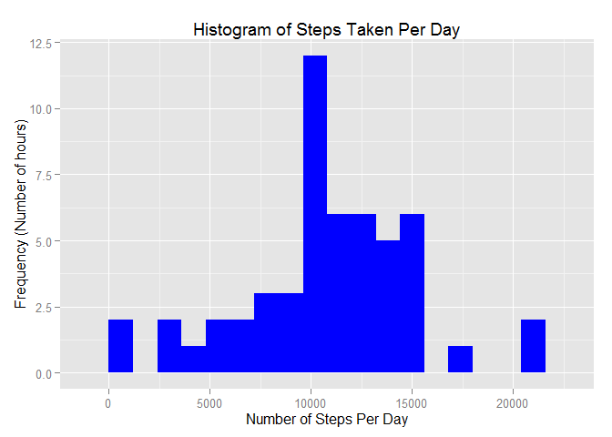
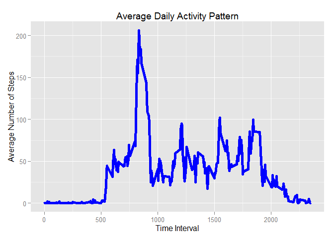
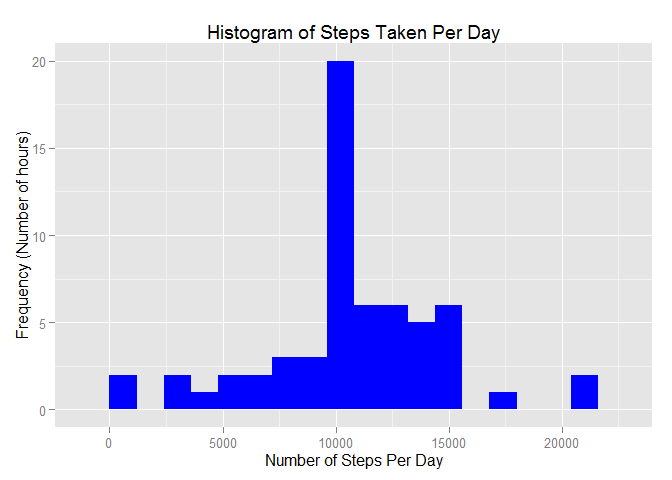
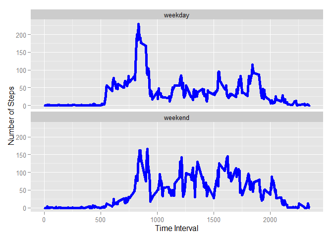

# Reproducible Research: Peer Assessment 1


```r
library(ggplot2)
```

```
## Warning: package 'ggplot2' was built under R version 3.1.2
```

```r
setwd("~/My Projects/data science/coursera/courses/05_ReproducibleResearch/homework 1/RepData_PeerAssessment1")
```
### **Loading and preprocessing the data**  
#### 1. Load the data (i.e. read.csv()) 

```r
all_activity <- read.csv("activity/activity.csv") 
```
#### 2. Process/transform the data (if necessary) into a format suitable for your analysis

```r
activity <- na.omit(all_activity)  
```

### **What is mean total number of steps taken per day?**

#### 1. Calculate the total number of steps taken per day  

```r
steps_by_day <- aggregate(steps ~ date, activity, sum)
```
#### 2. Make a histogram of the total number of steps taken each day

```r
ggplot(steps_by_day, aes(x = steps)) +
  geom_histogram(fill = "blue", binwidth=1200) +
  labs(title="Histogram of Steps Taken Per Day",
       x = "Number of Steps Per Day", y = "Frequency (Number of hours)")
```

 


#### 3. Calculate and report the mean and median of the total number of steps taken per day

```r
mean(steps_by_day$steps)
```

```
## [1] 10766.19
```

```r
median(steps_by_day$steps)
```

```
## [1] 10765
```
**The mean is 10766.19 and median is 10765.**

### **What is the average daily activity pattern?**

```r
steps_by_interval <- aggregate(steps ~ interval, activity, mean)
```
#### 1. Make a time series plot (i.e. type = "l") of the 5-minute interval (x-axis) and the average number of steps taken, averaged across all days (y-axis)

```r
ggplot(steps_by_interval, aes(x = interval, y = steps)) +
  geom_line(color="blue", size=2) +
  labs(title="Average Daily Activity Pattern", x="Time Interval",y="Average Number of Steps")
```

 


#### 2. Which 5-minute interval, on average across all the days in the dataset, contains the maximum number of steps?

```r
steps_max <- steps_by_interval[which.max(steps_by_interval$steps),]
steps_max$interval
```

```
## [1] 835
```
**The interval 835 contains the maximum number of steps.**

### **Imputing missing values**

#### 1. Calculate and report the total number of missing values in the dataset (i.e. the total number of rows with NAs)

```r
sum(is.na(all_activity$steps))
```

```
## [1] 2304
```
**The number of missing values is 2304.**

#### 2. Devise a strategy for filling in all of the missing values in the dataset. The strategy does not need to be sophisticated. For example, you could use the mean/median for that day, or the mean for that 5-minute interval, etc.

```r
na_fill <- function(data, pervalue) {
  na_index <- which(is.na(data$steps))
  na_replace <- unlist(lapply(na_index, FUN=function(idx){
    interval = data[idx,]$interval
    pervalue[pervalue$interval == interval,]$steps
  }))
  fill_steps <- data$steps
  fill_steps[na_index] <- na_replace
  fill_steps
}
```

**Use the mean of the time interval over different days to fill in missing values for that interval.**

#### 3. Create a new dataset that is equal to the original dataset but with the missing data filled in.

```r
all_activity_filled <- data.frame(  
  steps = na_fill(all_activity, steps_by_interval),  
  date = all_activity$date,  
  interval = all_activity$interval)

sum(is.na(all_activity_filled$steps))
```

```
## [1] 0
```
#### 4. Make a histogram of the total number of steps taken each day and Calculate and report the mean and median total number of steps taken per day. 

```r
steps_by_day <- aggregate(steps ~ date, all_activity_filled, sum)
ggplot(steps_by_day, aes(x = steps)) +
  geom_histogram(fill = "blue", binwidth=1200) +
  labs(title="Histogram of Steps Taken Per Day",
       x = "Number of Steps Per Day", y = "Frequency (Number of hours)")
```

 


```r
mean(steps_by_day$steps)
```

```
## [1] 10766.19
```

```r
median(steps_by_day$steps)
```

```
## [1] 10766.19
```
**The mean and median are both 10766.19.**

- Do these values differ from the estimates from the first part of the assignment? **Yes.**
- What is the impact of imputing missing data on the estimates of the total daily number of steps? **The mean and median are the same.**   

### Are there differences in activity patterns between weekdays and weekends?
#### 1. Create a new factor variable in the dataset with two levels - "weekday" and "weekend" indicating whether a given date is a weekday or weekend day.

```r
weekdays_steps <- function(data) {
  weekdays_steps <- aggregate(data$steps, by=list(interval = data$interval),
                              FUN=mean, na.rm=T)
  weekdays_steps$interval <- 
    as.integer(levels(weekdays_steps$interval)[weekdays_steps$interval])
  colnames(weekdays_steps) <- c("interval", "steps")
  weekdays_steps
}
```

```r
data_by_weekdays <- function(data) {
  data$weekday <- 
    as.factor(weekdays(data$date)) # weekdays
  weekend_data <- subset(data, weekday %in% c("Saturday","Sunday"))
  weekday_data <- subset(data, !weekday %in% c("Saturday","Sunday"))
  
  weekend_steps <- weekdays_steps(weekend_data)
  weekday_steps <- weekdays_steps(weekday_data)
  
  weekend_steps$dayofweek <- rep("weekend", nrow(weekend_steps))
  weekday_steps$dayofweek <- rep("weekday", nrow(weekday_steps))
  
  data_by_weekdays <- rbind(weekend_steps, weekday_steps)
  data_by_weekdays$dayofweek <- as.factor(data_by_weekdays$dayofweek)
  data_by_weekdays
}
```
#### clean up the formats

```r
all_activity_filled$date <- as.Date(all_activity_filled$date, format = "%Y-%m-%d")
all_activity_filled$interval <- as.factor(all_activity_filled$interval)

data_weekdays <- data_by_weekdays(all_activity_filled)
```
#### 2. Make a panel plot containing a time series plot (i.e. type = "l") of the 5-minute interval (x-axis) and the average number of steps taken, averaged across all weekday days or weekend days (y-axis). 

```r
ggplot(data_weekdays, aes(x=interval,y=steps)) +
  geom_line(color="blue",size=2) +
  facet_wrap(~ dayofweek, nrow=2, ncol=1) +
  labs(x="Time Interval", y="Number of Steps")
```

 


**Yes, there are differences in the weekday and weekend actitivity patterns.**
